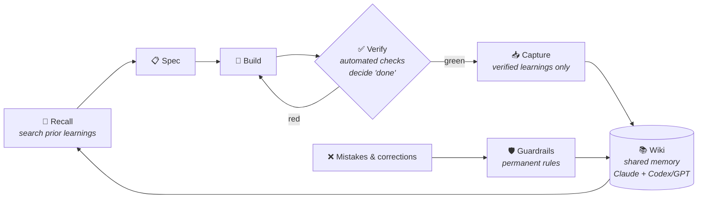

# Knowledge Memory Wiki Engine for Claude

**A shared, verified, self-improving memory for AI agents. One brain — many tools.**

## 1. The problem - It's Groundhog Day again

Every AI agent starts every session at zero:

- Solutions get rediscovered, mistakes get repeated — every session, forever.
- Claude, Codex & Co. each hoard private notes; none of them share.
- And the worst part: typical "agent memory" is whatever the LLM writes about its own
  work — unverified, self-flattering, often wrong. **Garbage in, garbage forever.**

## 2. How it solves it

This template turns agent memory into a shared, **evidence-gated Markdown wiki**:
agents recall existing knowledge before they work, verify changes before lessons are
promoted, and convert mistakes into durable guardrails.

It is not "LLM writes notes about itself." It is a tool-neutral operating protocol for
compounding project memory across Claude, Codex, GPT, and future agents.



Example: a failed implementation is never captured as experience. Only after the
project's verifier turns green does `/learn` promote the lesson into
`Wiki/experience/` — and the correction that got it there becomes a
`Wiki/guardrails/` rule.

What makes it different:

- **Evidence-gated memory.** The Karpathy-style loop — Spec → Verifier → Environment —
  makes "done" a testable state. Journal entries may hold working context, but durable
  knowledge, experience, ADRs, and guardrails need sources, decisions, or green
  verifiers. The wiki records what was verified, when, and by which check.
- **One brain, many tools.** [`WIKI_PROTOCOL.md`](WIKI_PROTOCOL.md) is the canonical
  protocol. `Claude.md` / `AGENTS.md` / `CODEX.md` are thin adapters — they contain no
  separate memories. Claude, Codex, and other agents read and write the **same** memory
  instead of building private silos.
- **Typed memory instead of note piles.** Each item has a clear home:
  `knowledge` for sourced facts, `experience` for verifier-backed lessons,
  `journal` for in-progress context, `adr` for decisions, `guardrails` for rules
  learned from mistakes, and `roster` for reusable agent roles. Proven, provisional,
  and historical context stay separate — agents can tell what is verified, what is
  tentative, and what must not be repeated.
- **Recall before research.** A local hybrid-search MCP (semantic + keyword + rank
  fusion) retrieves relevant wiki pages, guardrails, ADRs, and verifier-backed lessons
  *before* an agent starts coding or researching. Reuse what is already known; do not
  rediscover it.
- **Mistakes become guardrails.** Owner corrections and failed approaches become
  searchable rules that future agents load before they work. The goal is not perfect
  memory; it is making repeated mistakes visible, reviewable, and harder to repeat.
- **Project-local operating memory.** Each project defines its goal, backlog, verifier,
  environment contract, and team file locally, while reusable lessons flow back into
  the shared wiki.
- **Self-improving agent roles.** Projects compose small teams from reusable role
  briefs — specifier, implementer, verifier, reviewer, researcher, security, librarian,
  or domain-specific roles when new expertise is needed. New roles start on probation
  and earn a track record through verified work; retrospectives turn corrections into
  role improvements and guardrails. Adversarial review comes from a *different* model
  (GPT sparring), not self-review.

## 3. Features

### Core wiki protocol

- [`WIKI_PROTOCOL.md`](WIKI_PROTOCOL.md) — the tool-neutral operating protocol and
  single source of truth.
- Wiki skeleton — typed folders, page templates, and generic example pages (replace
  or delete).
- **Reusable agent-role roster** — canonical role briefs for composing project teams.

### Claude integration

- **`~/.claude` machinery** under `claude/`: agents, skills, commands, hooks.
- **Slash commands for the loop**: `/spec` (request → small verifiable spec) ·
  `/verify` (run `VERIFIER.md`, report green/red) · `/learn` (capture verified
  learnings into the wiki) · `/karpathy-init` (scaffold the 3 layers into a repo) ·
  `/wiki-review` (audit the wiki for correctness & freshness).

### Local recall and review add-ons

- **`recall-mcp/`** — local-first recall MCP server using SQLite FTS5, FastEmbed
  embeddings, sqlite-vec, and Reciprocal Rank Fusion. No API key required.
- **`addons/gpt-chat-mcp`** — cross-model sparring MCP (adversarial second opinion
  from GPT).
- **`addons/wiki-graph`** — lightweight interactive graph viewer inspired by Obsidian.

### Project bootstrap and synchronization

- **Repeatable project kickoff.** Every new project begins recall-first;
  `/karpathy-init` scaffolds a goal-driven spec, a verifier, an environment contract,
  `TEAM.md`, a backlog, and project-local memory. Verified lessons then flow back into
  the shared wiki.
- **`sync.ps1` / `sync.sh`** — refresh this template from a live system: placeholder
  rewriting (paths/names) + built-in secret/leak checks.

## 4. Bootstrap

1. Pick a wiki location; set it wherever `<WIKI_DIR>` appears (or use this repo as the wiki).
2. Copy `claude/{agents,skills,commands,CLAUDE.md}` into your `~/.claude/` (or symlink);
   adjust paths in `claude/CLAUDE.md`.
3. Deploy recall — follow [`recall-mcp/DEPLOY.md`](recall-mcp/DEPLOY.md): bootstraps the
   venv, registers the MCP, wires the post-commit reindex hook.
4. Restart Claude Code / Codex; confirm roles + skills load and `search_notes` works.

Running live system + this template? Re-sync after machinery changes:

```
./sync.ps1 -WikiSrc <live-wiki> -RecallSrc <recall-mcp>              # Windows
WIKI_SRC=<live-wiki> RECALL_SRC=<recall-mcp> ./sync.sh               # bash
```

See [`Wiki/guardrails/machinery-sync-engine-template.md`](Wiki/guardrails/machinery-sync-engine-template.md).

## License

[MIT](LICENSE) — free to use, share, and improve. The only obligation is keeping the
copyright notice (attribution to the source and creator). If you improve it, I'd love
to hear about it.
