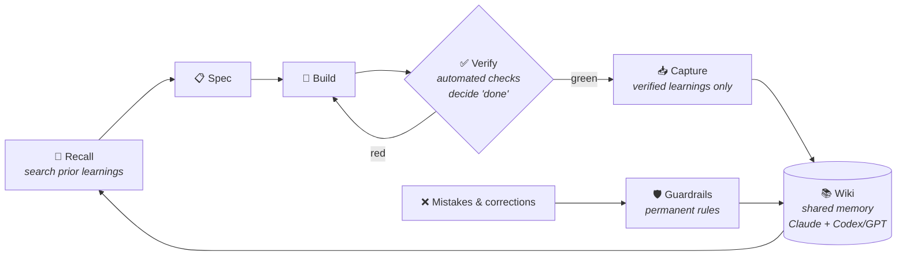

# Knowledge Memory Wiki Engine

**A local Markdown memory that Claude, Codex, and other agents share — without turning every note into trusted knowledge.**

## Quickstart — see recall work (10 minutes)

> Prerequisites: Python ≥ 3.10, Git, and an MCP client (Claude Code, Codex CLI, …).
> Windows note: the git hooks and `sync.sh` need Git Bash.

```bash
git clone https://github.com/Mace-Enterprise/Agent-Knowledge-Memory-Wiki.git
cd Agent-Knowledge-Memory-Wiki/recall-mcp
python -m venv .venv && .venv/Scripts/pip install -r requirements.txt   # .venv/bin on macOS/Linux
WIKI_DIR=../Wiki .venv/Scripts/python server.py index      # builds the local index — no API key
WIKI_DIR=../Wiki .venv/Scripts/python server.py search guardrails
```

Expected — ranked pages from the bundled wiki, keyword + semantic fused:

```json
{"title": "Machinery sync: keep the engine template in step with the live system", "path": "guardrails/machinery-sync-engine-template.md", "score": 0.0507}
{"title": "Guardrail — No unverified assumptions", "path": "guardrails/no-unverified-assumptions.md", "score": 0.0501}
```

That is the read side working. [Full setup](#4-full-setup--wire-it-into-your-agents) plugs
it into Claude Code / Codex as an MCP server and adds the write side: verified capture,
guardrails, publish gates.

## 1. The problem - It's Groundhog Day again

Every AI agent starts every session at zero:

- Solutions get rediscovered, mistakes get repeated — every session, forever.
- Claude, Codex & Co. each hoard private notes; none of them share.
- And the worst part: typical "agent memory" is whatever the LLM writes about its own
  work — unverified, self-flattering, often wrong. **Garbage in, garbage forever.**

## 2. How it solves it

This repo gives you a shared, **evidence-gated Markdown wiki** plus the Claude/Codex adapters to use it from agent sessions:
agents recall existing knowledge before they work, verify changes before lessons are
promoted, and convert mistakes into durable guardrails.

It is not "LLM writes notes about itself." It is a tool-neutral operating protocol for
compounding project memory across Claude, Codex, GPT, and future agents.



Example: a failed implementation is never captured as experience. Only after the
project's verifier turns green does `/learn` promote the lesson into
`Wiki/experience/` — and the correction that got it there becomes a
`Wiki/guardrails/` rule.

What makes it different:

- **Evidence-gated memory.** A spec → verify → capture loop makes "done" a testable
  state. Journal entries may hold working context, but durable
  knowledge, experience, ADRs, and guardrails need sources, decisions, or green
  verifiers. The wiki records what was verified, when, and by which check.
- **One brain, many tools.** [`WIKI_PROTOCOL.md`](WIKI_PROTOCOL.md) is the canonical
  protocol. `Claude.md` / `AGENTS.md` / `CODEX.md` are thin adapters — they contain no
  separate memories. Claude, Codex, and other agents read and write the **same** memory
  instead of building private silos.
- **Typed memory instead of note piles.** Each item has a clear home:
  `knowledge` for sourced facts, `experience` for verifier-backed lessons,
  `journal` for in-progress context, `adr` for decisions, `guardrails` for rules
  learned from mistakes, and `roster` for reusable agent roles. Proven, provisional,
  and historical context stay separate — agents can tell what is verified, what is
  tentative, and what must not be repeated.
- **Recall before research.** A local hybrid-search MCP (semantic + keyword + rank
  fusion) retrieves relevant wiki pages, guardrails, ADRs, and verifier-backed lessons
  *before* an agent starts coding or researching. Reuse what is already known; do not
  rediscover it.
- **Mistakes become guardrails.** Owner corrections and failed approaches become
  searchable rules that future agents load before they work. The goal is not perfect
  memory; it is making repeated mistakes visible, reviewable, and harder to repeat.
- **Project-local operating memory.** Each project defines its goal, backlog, verifier,
  environment contract, and team file locally, while reusable lessons flow back into
  the shared wiki.
- **Self-improving agent roles.** Reusable role briefs with earned track records;
  retrospectives turn corrections into role and guardrail updates, and adversarial
  review comes from a *different* model, not self-review.

## 3. Features

### Core wiki protocol

- [`WIKI_PROTOCOL.md`](WIKI_PROTOCOL.md) — the tool-neutral operating protocol and
  single source of truth.
- Wiki skeleton — typed folders, page templates, and generic example pages (replace
  or delete).
- **Reusable agent-role roster** — canonical role briefs for composing project teams.

### Claude integration

- **`~/.claude` machinery** under `claude/`: agents, skills, commands, hooks.
- **Slash commands for the loop**: `/spec` (request → small verifiable spec) ·
  `/verify` (run `VERIFIER.md`, report green/red) · `/learn` (capture verified
  learnings into the wiki) · `/karpathy-init` (scaffold the 3 layers into a repo) ·
  `/wiki-review` (audit the wiki for correctness & freshness) · `/handoff` (save
  in-flight session state; auto-triggered when context fills, reinjected next session).

### Local recall and review add-ons

- **`recall-mcp/`** — local-first recall MCP server using SQLite FTS5, FastEmbed
  embeddings, sqlite-vec, and Reciprocal Rank Fusion. No API key required. It also
  records its own usage: which pages get surfaced, which actually get opened (derived
  from behaviour, never self-reported), plus recency and status signals in ranking —
  so the wiki can be asked which of its pages are earning their keep.
- **`addons/gpt-chat-mcp`** — cross-model sparring MCP (adversarial second opinion
  from GPT).
- **`addons/wiki-graph`** — lightweight interactive graph viewer inspired by Obsidian.

### Project bootstrap and synchronization

- **Repeatable project kickoff.** Every new project begins recall-first;
  `/karpathy-init` scaffolds a goal-driven spec, a verifier, an environment contract,
  `TEAM.md`, a backlog, and project-local memory. Verified lessons then flow back into
  the shared wiki.
- **`sync.ps1` / `sync.sh`** — refresh this template from a live system: placeholder
  rewriting (paths/names) + built-in secret/leak checks. The substitution map lives
  outside the sanitizer (`sync.map`, git-ignored), so the tool that removes private
  strings does not itself contain them.
- **`leak-check.sh` + `.githooks/pre-push`** — fail-closed publish gate. The hook checks
  the *commit being pushed*, not the working tree, and refuses when a prerequisite is
  missing: a check that cannot run is a failure, not a pass.
- **`attest.sh` + `guardrail-report.py`** — a verifier writes its own attestation on a
  green run, and an experience page must reference one that exists (ADR 0005). Guardrails
  emit events when they run or block, so "does this rule actually bite?" is a question
  with an answer instead of an opinion.

## 4. Full setup — wire it into your agents

1. Use the included `Wiki/` first: set `WIKI_DIR` to this repo's `Wiki` folder (quickstart above). Point it at your real wiki after the first successful search.
2. Copy `claude/{agents,skills,commands,CLAUDE.md}` into your `~/.claude/` (or symlink);
   adjust paths in `claude/CLAUDE.md`.
3. Deploy recall — follow [`recall-mcp/DEPLOY.md`](recall-mcp/DEPLOY.md): bootstraps the
   venv, registers the MCP, wires the post-commit reindex hook.
4. Restart your MCP client, then run `search_notes("guardrails")` — expect ranked Markdown pages from `Wiki/`, like the quickstart output above.
5. If you will publish from this repo: copy `sync.map.example` to `sync.map`, fill in
   your real paths, and run `git config core.hooksPath .githooks`. The pre-push hook
   then leak-checks the commit being pushed and refuses a tree that fails.

Running live system + this template? Re-sync after machinery changes:

```
./sync.ps1 -WikiSrc <live-wiki> -RecallSrc <recall-mcp>              # Windows
WIKI_SRC=<live-wiki> RECALL_SRC=<recall-mcp> ./sync.sh               # bash
```

See [`Wiki/guardrails/machinery-sync-engine-template.md`](Wiki/guardrails/machinery-sync-engine-template.md).

## Related tools

Not a note app, and not a memory service — it complements both. Point Obsidian at the
wiki if you want a nicer editor; let your orchestrator (LangGraph, MetaGPT, the OpenAI
Agents SDK) recall from it before it plans. Next to a memory service like mem0 or cognee
the difference is what gets *in*: a lesson only after a green verifier, a fact only with
a source.

## License

[PolyForm Noncommercial 1.0.0](LICENSE) — free for personal, hobby, research, and any
other noncommercial use, changes and forks welcome. **Commercial use requires a separate
paid license**: see [COMMERCIAL-LICENSE.md](COMMERCIAL-LICENSE.md). If you improve it,
I'd still love to hear about it.
